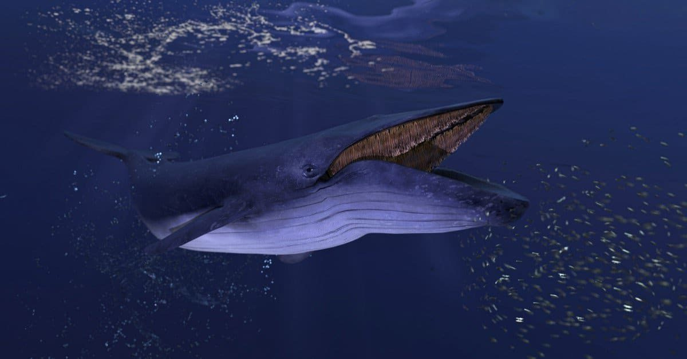

# The Blue Whale Trading Card

This project is a simple HTML and CSS implementation of a trading card for the majestic Blue Whale. It provides basic information and features of the largest animal on Earth.

## Preview

## Description

The blue whale is the largest animal ever to have lived on Earth. It's even bigger than the enormous dinosaurs that lived over 65 million years ago! Blue whales migrate long distances, traveling alone or in small groups called pods.

## Features

- **Whales Can Grow More Than 100 Feet Long:** Blue whales are immense creatures, often surpassing 100 feet in length.
- **Can Weigh as Much as 30 Elephants:** Despite their size, they are surprisingly graceful swimmers.
- **They Have Big Hearts:** Blue whales have the largest hearts of any animal, weighing as much as a car.
- **They Have Big Tongues, Too:** Their tongues alone can weigh as much as an elephant.
- **They Have the Biggest Babies on Earth:** Blue whale calves are born weighing up to 3 tons and measuring 25 feet in length.
- **They're Unusually Loud:** Blue whales produce some of the loudest sounds in the animal kingdom, with their calls reaching volumes louder than a jet engine.
- **They Eat a Lot of Krill:** Blue whales primarily feed on tiny shrimp-like animals called krill.
- **They're Pretty Fast:** Despite their size, blue whales are capable of swimming at speeds of up to 20 miles per hour.

## Usage

Simply open the `index.html` file in your web browser to view the Blue Whale Trading Card.

## Credits

This trading card template was created by Ginger for educational purposes.
